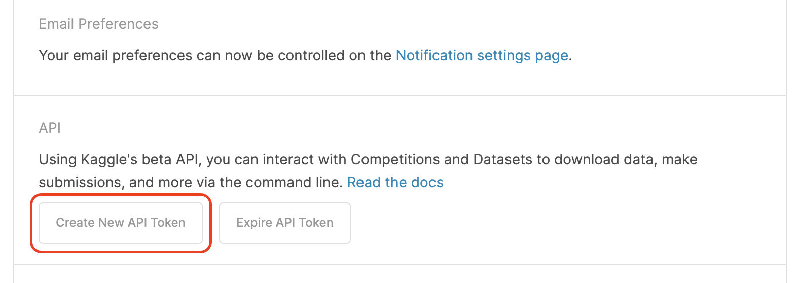

[Log into your Kaggle account here.](https://www.kaggle.com/account/login)

Follow the highlighted steps.




A file called `kaggle.json` will be downloaded, open it in any text editor:

`kaggle.json`
```json
{"username":"username","key":"abcd1234defg5678abcd1234defg5678"}
```

Extract the username and key and fill the `.env` file accordingly (create it if it does not exist):

`.env`
```.env
KAGGLE_USERNAME=username
KAGGLE_KEY=abcd1234defg5678abcd1234defg5678
```

In order for the setup script to work, ensure your python instance can be invoked via the `python` command:

```sh
> python --version
Python 3.11.2
```

Finally, run the following command:

```sh
./setup.sh
```

The script will create a virtual python environment, install kaggle CLI and download the datasets into the `datasets` directory. If any of these already exist, they will be deleted.