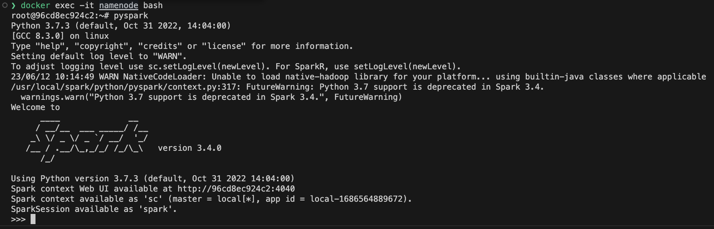
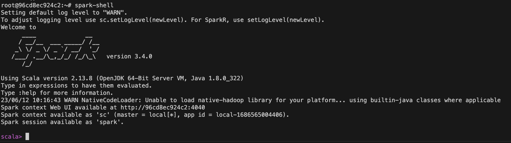
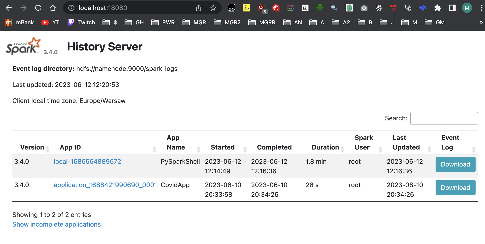
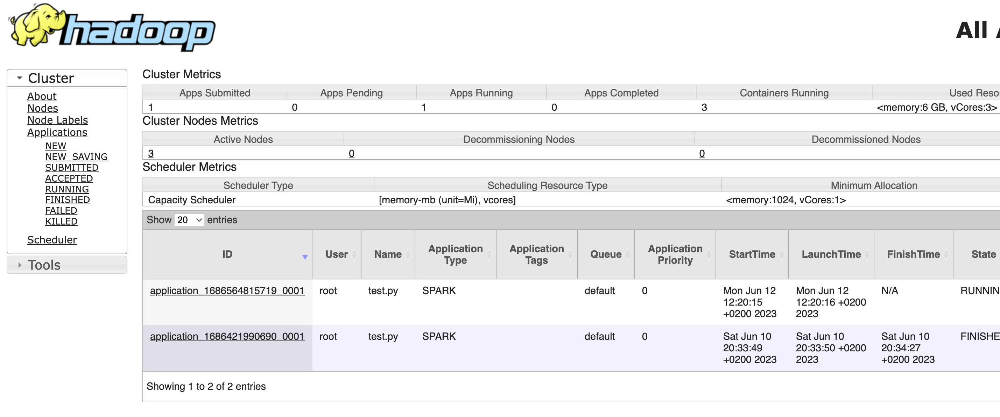

# Sprawozdanie 10

**Grupa A3:**

inż. Michał Liss

inż. Marceli Sokólski

inż. Piotr Krzystanek

## Instalacja spark w kontenerze namenode

```docker
RUN tar -xzf spark-3.4.0-bin-hadoop3-scala2.13.tgz
RUN mv spark-3.4.0-bin-hadoop3-scala2.13 /usr/local/spark
RUN rm spark-3.4.0-bin-hadoop3-scala2.13.tgz
ENV SPARK_HOME=/usr/local/spark
ENV PATH="${PATH}:${SPARK_HOME}/bin"
```

## Instalacja python w pozostałych węzłach klastra

```docker
RUN apt-get update && DEBIAN_FRONTEND=noninteractive apt-get install -y --no-install-recommends python3.6
RUN update-alternatives --install /usr/bin/python python /usr/bin/python3 1
```

## pyspark


## spark-shell


## historyserver


## Przykładowy skrypt (pyspark + pyspark.sql)
```python
from pyspark.sql import SparkSession

covid = "/datasets/covid-dataset.jsonl"
spark = SparkSession.builder.appName("CovidApp").getOrCreate()

df = spark.read.json(covid)
df.select("location").write.csv('/spark-result/dataframe-select', header=True)

spark.read.json(covid).createOrReplaceTempView("covid")
spark.sql("SELECT location FROM covid").write.csv('/spark-result/sql-select', header=True)

spark.stop()
```

## Uruchomienie z poziomu jupyter notebook
```python
_ = run_in_master("spark-submit --master yarn --deploy-mode cluster /data/master_volume/spark_scripts/test.py")
_ = merge_results("/spark-result/sql-select")
print_hdfs_output("/spark-result/sql-select")
```

## Uruchomiona aplikacja na hadoopie
