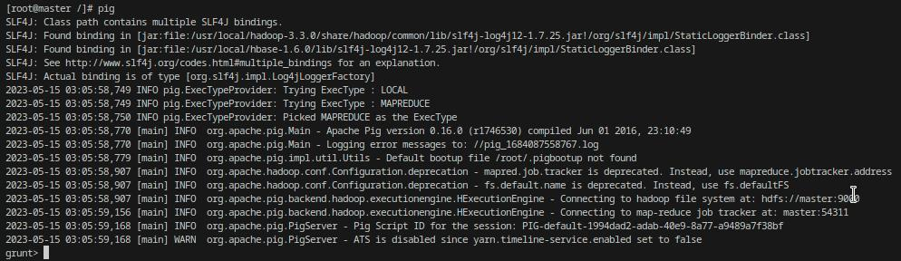
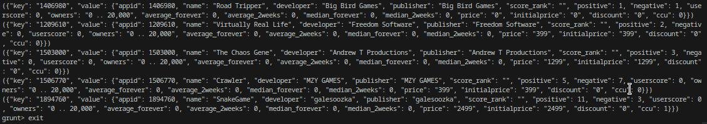

# Instalacja

1. Pobranie apache pig z http://mirrors.estointernet.in/apache/pig/pig-0.16.0/
   
2. Modyfikacja obrazu docker z nodem master:
```docker
FROM hjben/hadoop-eco

COPY pig-0.16.0 /usr/local/pig

ENV PIG_HOME=/usr/local/pig
ENV PATH=$PATH:$PIG_HOME/bin
```

# Uruchomienie

Na nodzie master komenda:
```bash
pig
```



# Przykład działania:
```bash
lines = LOAD '/datasets/steam-dataset/steam_dataset/steamspy/basic/steam_spy_scrap.jsonl' AS (line: chararray);
Dump lines
```



